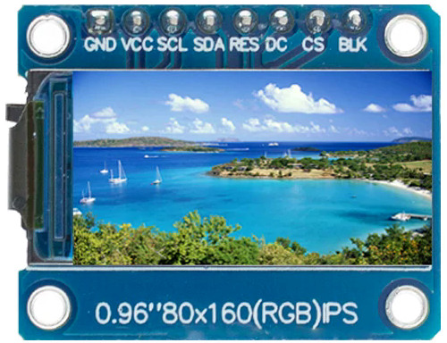
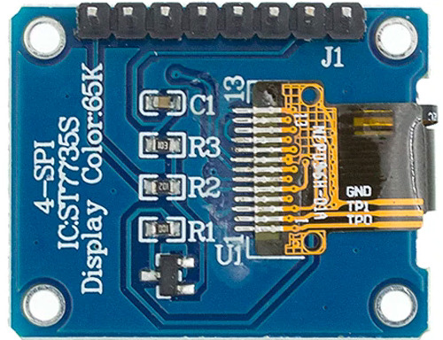
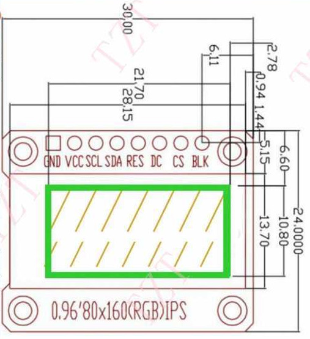

# OLED RGB-Display 0.96"
## Inhaltsverzeichnis
1. [x] [Inhaltsverzeichnis](#Inhaltsverzeichnis)
1. [ ] [Beschreibung](#Beschreibung)
1. [x] [Hardware](#Hardware)
   1. [x] [Technische Daten](#technische-daten)
   1. [ ] [Datasheet](#datasheet)
   1. [ ] [PCB](#PCB)
1. [x] [Software](#Software)
1. [ ] [3D](#3D)
1. [x] [Where to buy](#Where-to-buy)
1. [x] [Abbildungen](#Abbildungen)
1. [x] [Credits](#Credits)

## Beschreibung
bla

## Hardware
### Technische Daten
* Modell: 0.96 Oled RGB-Display
* Typ: 8Pin 
* Pixel: 80 x 160
* Display-Height: 10.8mm
* Display-Width: 21.696mm
* Module-Height: 20mm
* Module-Width: 30mm
* Power Supply: 3.3V - 5.0V
* Driver IC: ST7735
* Interface: SPI
* Color: 65K Full COlor
* Operating Temperature: -20° - +70°C
* LCSC Part #: 
* EAN / GTIN: 

### Datasheet
* no datasheet available
### PCB
## Software
* 
* 
## 3D

## Where to buy
~ 2.5 EUR for 1pcs: [AliExpress](https://www.aliexpress.com/item/32918394604.html)

## Abbildungen

## Credits
* :+1: [arduino](https://github.com/arduino)
* :+1: [adafruit](https://github.com/adafruit)
* :+1: [sparkfun](https://github.com/sparkfun)
* :+1: [Watterott](https://github.com/watterott) and @awatterott for great SW, HW and products
* :+1: [atom](https://github.com/atom)
* :+1: [mattahan](https://www.deviantart.com/mattahan) for the [Buuf graphics](https://www.deviantart.com/mattahan/art/Buuf-37966044)
* :+1: @ikatyang for the [emoji-cheat-sheet](https://github.com/ikatyang/emoji-cheat-sheet/blob/master/README.md)
